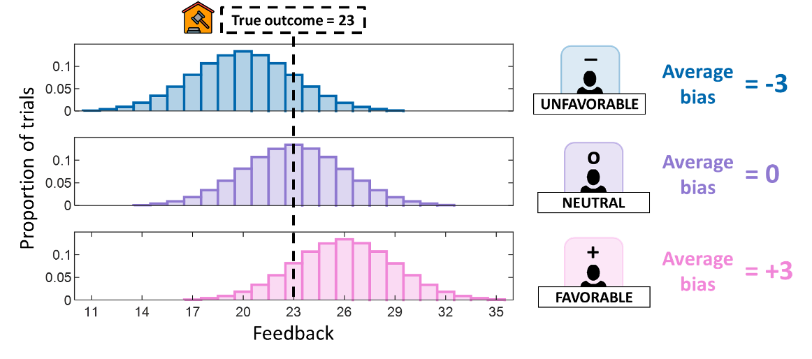

---

##### Download

+ [Preprint link](https://osf.io/preprints/psyarxiv/rk52q_v1)
+ [Paper download](BiasedMisinformationDistortsBeliefs.pdf)
+ [SI download](SI_BiasedMisinformationDistortsBeliefs.pdf)
<!-- + [Code and data](https://github.com/pmichaillat/feru) -->

---

##### Abstract

We often form beliefs about events we cannot directly observe by relying on information provided by others. However, these sources may be biased, potentially distorting our beliefs and behavior. Here, we examine whether individuals can detect biased sources and mitigate their influence. We studied a large cohort of participants who completed a decision-making task involving choices between lotteries. Outcome feedback was provided by sources that were either unbiased or biased in a favorable or unfavorable direction. Participants initially learned about source biases, and later, used this knowledge to interpret biased feedback and adjust belief updating. Using a reinforcement learning framework, we show that participants successfully distinguished between favorable, unfavorable, and unbiased sources and adjusted for biased feedback. However, these corrections were incomplete, allowing residual biases to continue shaping beliefs and decisions. Moreover,  following  exposure  to  biased  sources,  participants  systematically  misperceived unbiased sources as biased. Strikingly, participants prioritized learning about source biases over value learning, resulting in reduced task performance. Our findings highlight the challenge of forming accurate beliefs in biased environments and offer insights for countering misinformation.

---

##### Citation

Vidal-Perez, J., Dolan, R. J., & Moran, R. (2025, March 31). Biased Misinformation Distorts Beliefs. https://doi.org/10.31234/osf.io/rk52q_v1

```latex
@article{vidal2025biased,
  title={Biased Misinformation Distorts Beliefs},
  author={Vidal-Perez, Juan and Dolan, Raymond J and Moran, Rani},
  year={2025},
  publisher={OSF}
}
```

---

