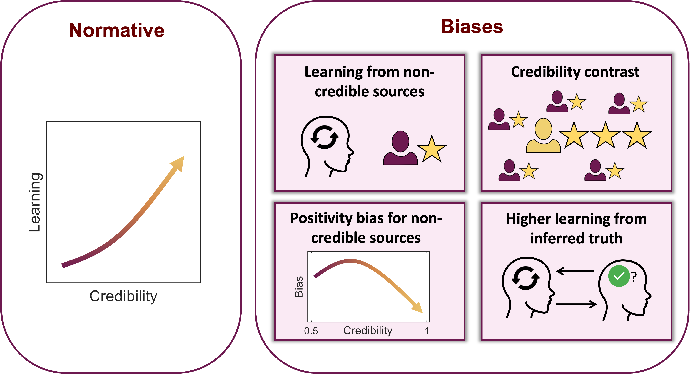

---

##### Download

+ [eLife link](https://elifesciences.org/reviewed-preprints/106073)
+ [Paper download](DisinformationElicitsLearningBiases.pdf)
+ [eLife reviews](https://elifesciences.org/reviewed-preprints/106073/reviews#review-process)
<!-- + [Code and data](https://github.com/pmichaillat/feru) -->

---

##### Abstract

In open societies disinformation is often considered a threat to the very fabric of democracy. However, we know little about how disinformation exerts its impact, especially its influences on individual learning processes. Guided by the notion that disinformation exerts its pernicious effects by capitalizing on learning biases, we ask which aspects of learning from potential disinformation align with ideal “Bayesian” principles, and which exhibit biases deviating from these standards. To this end, we harnessed a reinforcement learning framework, offering computationally tractable models capable of estimating latent aspects of a learning process as well as identifying biases in learning. In two experiments, participants completed a two-armed bandit task, where they repeatedly chose between two lotteries and received outcome-feedback from sources of varying credibility, who occasionally disseminated disinformation by lying about true choice outcome (e.g., reporting non reward when a reward was truly earned or vice versa). Computational modelling indicated that learning increased in tandem with source credibility, consistent with ideal Bayesian principles. However, we also observed striking biases reflecting divergence from idealized Bayesian learning patterns. Notably, in one experiment individuals learned from sources that should have been ignored, as these were known to be fully unreliable. Additionally, the presence of disinformation elicited exaggerated learning from trustworthy information (akin to jumping to conclusions) and exacerbated a normalized measure of “positivity bias” whereby individuals self-servingly boost their learning from positive, relative to negative, choice-feedback. Thus, in the face of disinformation we identify specific cognitive mechanisms underlying learning biases, with potential implications for societal strategies aimed at mitigating its harmful impacts.

---

##### Citation

Vidal-Perez Juan, Dolan Raymond J, Moran Rani (2025) Disinformation elicits learning biases eLife 14:RP106073
https://doi.org/10.7554/eLife.106073.3

```latex
@article{vidal2025disinformation,
  title={Disinformation elicits learning biases},
  author={Vidal-Perez, Juan and Dolan, Raymond J and Moran, Rani},
  journal={eLife},
  volume={14},
  year={2025},
  publisher={eLife Sciences Publications Limited}
}
```

---

