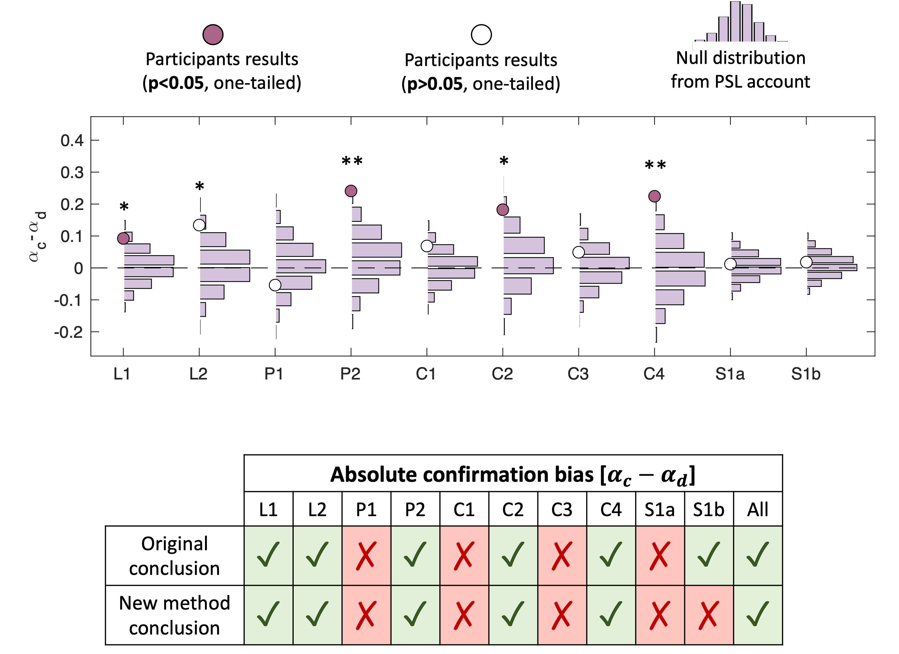

---

##### Download

+ [Preprint link](https://osf.io/preprints/psyarxiv/xdse5_v1)
+ [Paper download](PBPERS.pdf)
+ [SI download](SI.pdf)
<!-- + [Code and data](https://github.com/pmichaillat/feru) -->

---

##### Abstract

A central challenge in cognitive science is to distinguish betweenmultiple processes that can result in similar behaviours. In reinforcement learning (RL), oneprominent example concerns two potential drivers of choice repetition: (i) a confirmation-bias learning asymmetry, in which agents learn more from outcomes that confirm their choices, and (ii) choice perseveration, an outcome-independent tendency to repeatpast choices. Evidencefor asymmetric learning hastypicallyrelied on computational models that control for perseveration, orspecificbehavioural markers designed to reveal asymmetric learning.Here, we show both these approaches have critical flaws and can spuriously detect learning asymmetrieseven  in  perseverative,  symmetric-learningagents. Toaddress this, we introduce a novel statistical test that distinguishes genuine learning asymmetries from spurious effects.Applying this test to a large dataset spanning ten published experiments, we find that some previously reported confirmation biases are fragile, albeit others remain robusteven at a meta-analytic level.Finally, we propose a new task design that can yielda more validqualitative signature of confirmation bias. We suggest our approach provides a reliableframework for disentangling processes underlying choice repetition, while providing tools for  the  wider  research  community that  canminimizepotential spurious  effects  arising  from process mimicry and biased parameter estimation.

---

##### Citation

Vidal-Perez, J., Dolan, R., & Moran, R. (2025, September 17). Learning asymmetry or perseveration? A critical re-evaluation and solution to a pervasive confound. https://doi.org/10.31234/osf.io/xdse5_v1

```latex
@article{vidallearning,
  title={Learning asymmetry or perseveration? A critical re-evaluation and solution to a pervasive confound},
  author={Vidal-Perez, Juan and Dolan, Raymond and Moran, Rani},
  publisher={OSF}
}
```

---

