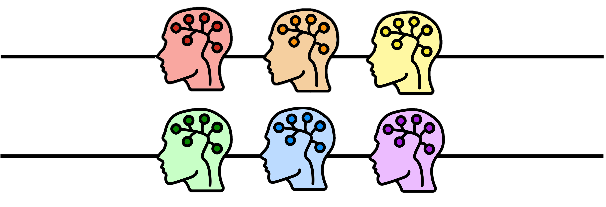

---
### Overview

The goal of computational modeling in behavioral science is to use precise mathematical models to make better sense of behavioral data. The behavioral data most often come in the form of choices, but can also be reaction times, eye movements, or other easily observable behaviors, and even neural data. The models come in the form of mathematical equations that link the experimentally observable variables (e.g. stimuli, outcomes, past experiences) to behavior in the immediate future. In this sense, computational models instantiate different ‘algorithmic hypotheses’ about how behavior is generated.

Computational modelling is a very extensive topic, but in this workshop we will go over three uses of modelling that dominate the literature:

- **Part 1: Simulations.** We will learn how to simulate data from a synthetic agent playing an n-armed bandit task. We will understand how the Rescorla-Wagner model works, and how it can inform action selection. Finally, we will get an intuition of how the parameters of the model can have an impact on behavior.

- **Part 2: Parameter fitting.** We will fit a dataset to our model and take a look at what parameters best explain the behavior in the dataset. We will also take a look at best practices, such as parameter recovery.

- **Part 3: Model comparison.** We will learn how to decide which of several models best explains a dataset.

### Contents

The main contents of the course are:

- **[Main workshop](https://github.com/Juan-VidalPerez/Modelling_workshop/blob/main/Modelling_workshop.ipynb)**: jupyter notebook with a "fill-in the blanks" version of the workshop.
- **[Workshop with solutions](https://github.com/Juan-VidalPerez/Modelling_workshop/blob/main/Modelling_workshop.ipynb)**: jupyter notebook of the workshop with solutions.
- **[Slides](UCLPKU_Modelling_pptx.pdf)**: slides used in the workshop.

